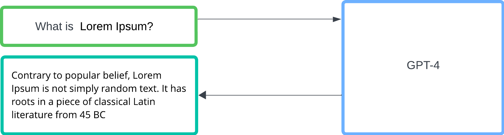
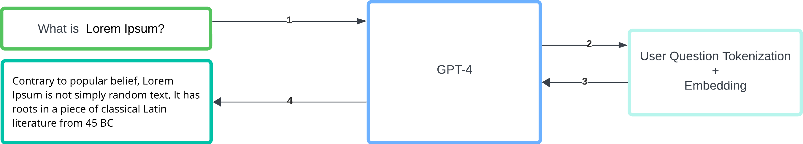
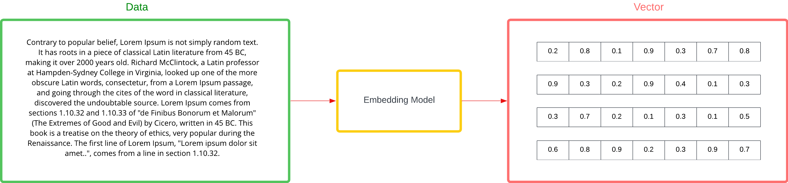
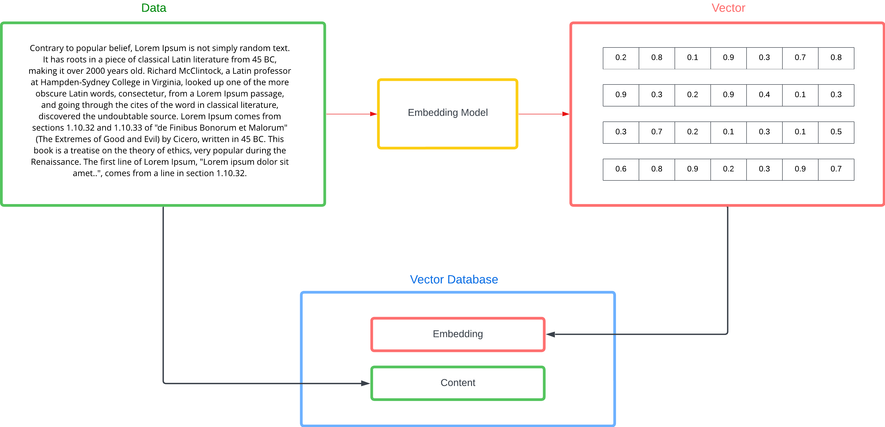
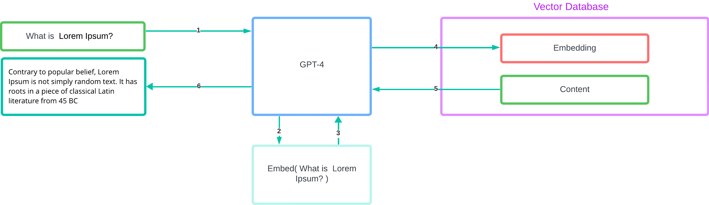

# OpenAI Toolkit: Patterns and Practices for RAG / Bring Your Own Data

Here, you'll find a collection of straightforward examples showcasing different ways to integrate and utilize OpenAI's capabilities. We've broken down each method into clear, manageable parts, making it easy for anyone to grasp and apply, regardless of their technical background. Our aim is to demystify AI, one pattern at a time, using plain language and practical examples. Whether you're a beginner or looking to expand your toolkit, this resource is designed for you!

## OpenAI Review

When delving into the world of OpenAI, there are two fundamental concepts that are essential to understand:

- Chat Completion / General LLM: This refers to the use of large language models (LLM) like GPT (Generative Pre-trained Transformer) for generating text.

- Embeddings: The process of converting data, such as text or images, into a vector format. 

### GPT Models (LLM's)

GPT (Generative Pre-trained Transformer) models are a type of artificial intelligence developed by OpenAI that specialize in generating text. These models are trained on vast amounts of text data to learn patterns, nuances, and the structure of human language. Once trained, GPT models can generate coherent, contextually relevant text based on the input they receive.

This diagram illustrates the interaction between a user and a GPT model. However, it's important to note that there is a bit more to the flow than it appears. 

Before responding, the user's query is first transformed (tokenized) and embedded by the GPT model, which helps in understanding the context and content of the question more effectively.

We will explore this pattern in more detail in the RAG / Bring Your Own Data flows.

### Embeddings

Embeddings are a powerful technique used to convert raw data—like text, images, or even sounds—into a structured, numerical format known as vectors. These vectors are constructed in such a way that they capture the essential aspects of the data, like meaning, context, or relationships, in a format that machines can understand and process.

#### Embeddings Model Specifications

| Model ID                             | Max Request (tokens) | Output Dimensions 
| ------------------------------------ | -------------------- | ----------------- |
| `text-embedding-ada-002 (version 2)` | 8,191                | 1,536             |
| `text-embedding-ada-002 (version 1)` | 2,046                | 1,536             |
| `text-embedding-3-large`             | 8,191                | 3,072             |
| `text-embedding-3-small`             | 8,191                | 1,536             |

#### Understanding the Specifications

- **Model ID**: Identifies the specific version of the embedding model
  - The model you will specify when calling the embeddings endpoint
- **Max Request (tokens)**: Indicates the maximum number of tokens that can be processed in a single request 
  - This comes into play when we have lots of data that will need to be embedded.
  - When planning to embed a large ammount of data we will need to break it up into 'chunks' <= to the Max Request tokens of the respective embedding model  
- **Output Dimensions**: Specifies the size of the output vector for each embedding.
  - After embedding we will need a place to store the vector. A few data store options include Azure AI Search, MongoDB, Redis Enterprise 
  - When configuring the data store we need to ensure that the vector field dimensions are set to the output dimensions of our model

## Retrieval Augmented Generation (RAG) / Bring Your Own Data (BYOD) Overview

The RAG pattern involves integrating a retrieval component with a generative model, such as GPT. This approach enables the model to pull relevant information from a predefined dataset or knowledge base before generating a response. By querying external data in real-time, the model can provide more accurate, informed, and contextually relevant outputs. The "bring your own data" aspect allows users to customize the external datasets according to their specific needs, thus grounding the model's responses in targeted, relevant information. This methodology not only improves the quality of the responses but also enhances the model’s ability to handle specific topics or detailed queries beyond its initial training data.

#### Vector Store

A common way of implementing RAG is via a vector store such as Azure AI Search, Mongo CosmosDB and Redis Enterprise. 

Vector store databases have 2 primary fields of intrest

- **Embedding**: The Vector representation of the content (Embedding)
  - This is what we ultimately run the similarity search against.
- **Content**: The actual text content that was embedded
  - This is what is passed to the GPT model to then formulate the answer

##### Getting Data Into a Vector Store

As mentioned, in order to get the data into a vector store, we first embed the data and store the embedding along with the text content.

##### Getting Data out of the Vector Store

In order to get the data relevant to the user question out of the vector store we first embed the user question, perform a vector similarity search and return the corresponding content to the language model so that it can arrive at the answer based on stored information.

